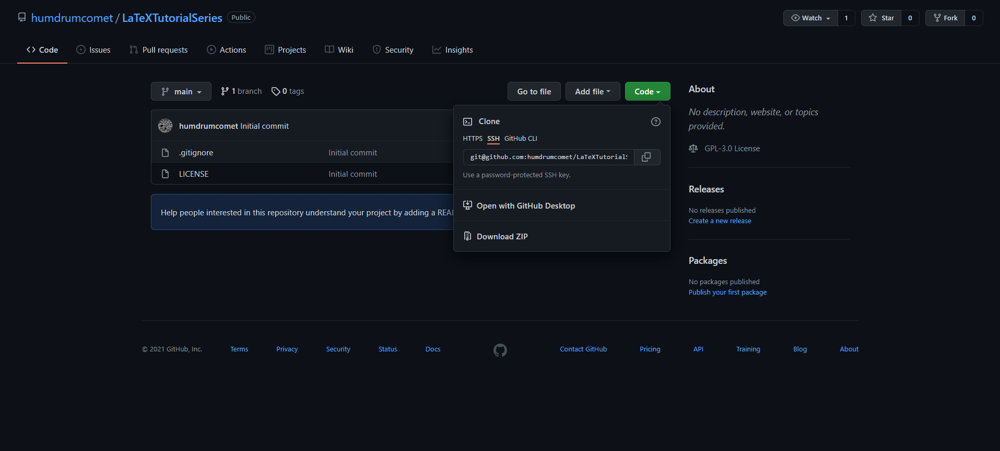
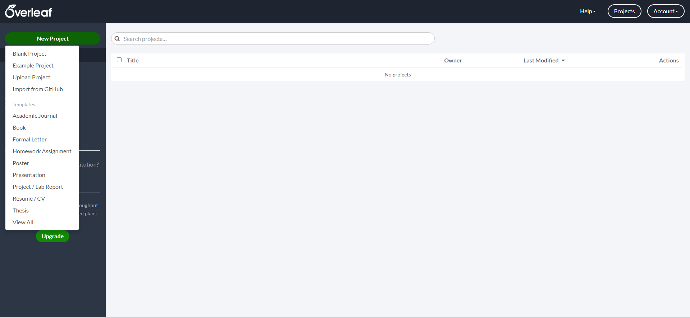

# LaTeX Interactive Coding Session

This is the blank companion document to the LaTeX introduction workshop (main repo here [here](https://github.com/humdrumcomet/LaTeXIntroduction)).
This empty document is intended to be used as a starting point for a guided coding session, but can work well as a starting point for a separate project as well.

To return to the top level directory of the tutorials, click [here](https://github.com/humdrumcomet/LaTeXTutorialSeries).\
To go to the next workshop in the series, click [here](https://github.com/humdrumcomet/LaTeXAdvancedWorkshop).

## Usage
To use this repository with Overleaf, follow the instructions below:

1. Select the `Code` green button and then select `Download ZIP` as shown below.

2. Navigate to Overleaf and once logged in, select the `New Project` green button at the top left corner of the screen.

3. Select the `Upload Project` option from the menu.

4. Click the `Select a .zip file` button and upload the downloaded zip file.

5. The LaTeX project is started and you are ready for some coding!

## Authors and Organizers

* Ghassan Arnouk
* Alec Bales D'Cruze
* Aaron English

## License

This project is licensed under the [GNU General Public License](LICENSE)

[LICENSE]: https://github.com/humdrumcomet/LaTeXTutorialSeries/blob/main/LICENSE
